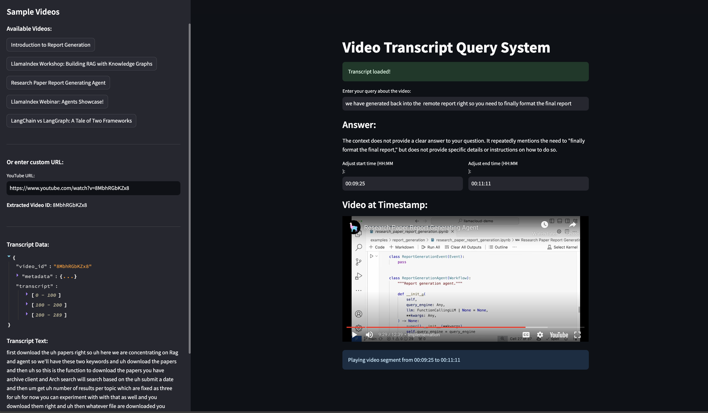

<div align="center">

# YouTube Video Transcript RAG System

An AI-powered tool for extracting, analyzing, and querying YouTube video transcripts with precise timestamp retrieval.


</div>

## Features

- **Transcript Extraction**: Automatically extract transcripts from YouTube videos
- **Semantic Search**: Find relevant segments using natural language queries
- **Timestamp Navigation**: Jump to exact moments in videos
- **Interactive UI**: User-friendly Streamlit interface
- **Database Storage**: Efficient SQLite-based transcript management

## Setup

1. **Clone the Repository**
   ```bash
   git clone https://github.com/ravikumarmn/RAG-Video-Transcription
   cd RAG-Video-Transcription
   ```

2. **Install Dependencies**
   ```bash
   pip install -r requirements.txt
   ```

3. **Configure OpenAI API Key**
   - Add your OpenAI API key to `.streamlit/secrets.toml`:
     ```toml
     OPENAI_API_KEY = "your-api-key"
     ```

## Usage

1. **Start the Application**
   ```bash
   streamlit run src/streamlit_run.py
   ```

2. **Using the Interface**
   - Choose from sample videos in the sidebar
   - Or enter a custom YouTube URL
   - Ask questions about the video content
   - View responses with exact timestamps
   - Play video segments directly in the interface

## Project Structure

```
RAG-Video-Transcription/
├── streamlit_run.py    # Main Streamlit application
├── video_rag.py        # RAG system implementation
├── db_utils.py         # Database management
├── requirements.txt    # Project dependencies
└── data/              # Stored transcripts
```

## Features in Detail

### 1. Video Processing
- Dynamic video ID extraction
- Automatic transcript fetching
- Efficient storage and retrieval

### 2. Query Processing
- Context-aware responses
- Precise timestamp matching
- Semantic search capabilities

### 3. User Interface
- Interactive video selection
- Real-time query processing
- Timestamp-based navigation
- Collapsible transcript view

## Dependencies

- streamlit
- streamlit-player
- langchain
- openai
- chromadb
- youtube-transcript-api
- python-dotenv

## Notes

- Requires YouTube videos with available transcripts
- OpenAI API key required for operation
- Internet connection needed for video access
